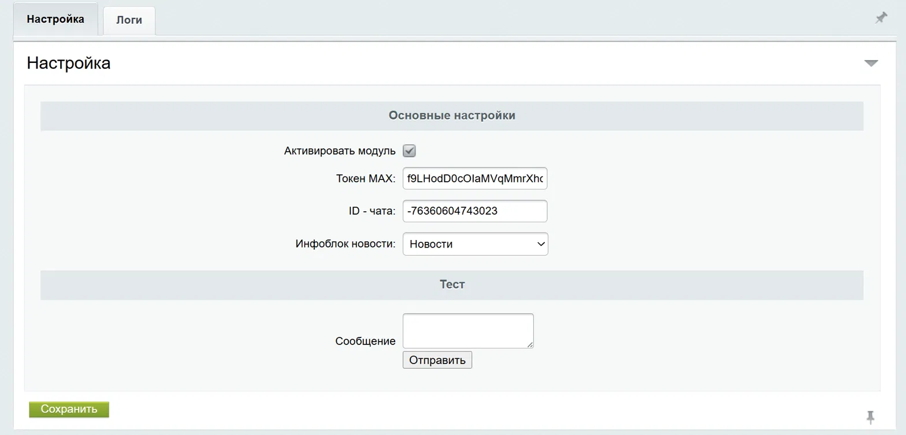
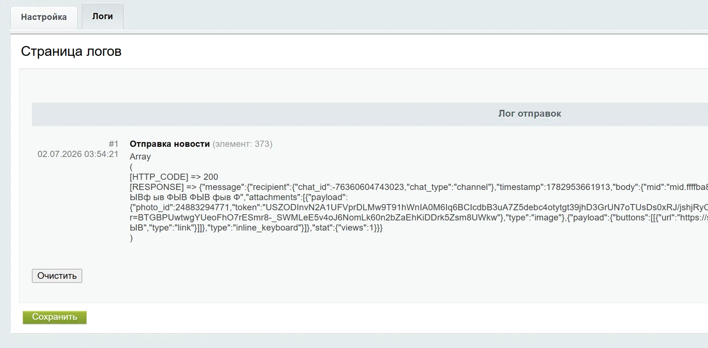

# chestnov.notificationsmax

Модуль для 1С-Битрикс. Автоматическая отправка уведомлений в **MAX Messenger** при добавлении новых элементов инфоблока (новостей).




---

## Возможности

- Автоматическая отправка сообщения в MAX Messenger при добавлении нового элемента инфоблока
- Отправка картинки (превью новости) вместе с сообщением
- Кнопка-ссылка на детальную страницу новости прямо в сообщении
- Тестовая отправка сообщения прямо из админки
- Лог всех отправок с пагинацией и возможностью очистки
- Выбор инфоблока для отслеживания
- Возможность включить/выключить модуль без деинсталляции

---

## Требования

- 1С-Битрикс: Управление сайтом любой редакции
- PHP 8.0+
- Модуль **Информационные блоки** (`iblock`)
- Токен бота и ID чата MAX Messenger

---

## Установка

1. Скопировать папку `chestnov.notificationsmax` в `/local/modules/`
2. Перейти в админке: **Marketplace → Установленные решения**
3. Найти модуль **MAX Messenger** и нажать **Установить**

При установке автоматически:
- Регистрируется обработчик события `OnAfterIBlockElementAdd`
- Создаётся таблица логов `b_chestnov_notificationsmax_log`
- Копируется файл страницы в `/bitrix/admin/`

---

## Настройка

Перейти в админке: **Сервисы → MAX Messenger**

| Поле | Описание |
|---|---|
| Активировать модуль | Включить/выключить отправку уведомлений |
| Токен MAX | Access token бота MAX Messenger |
| ID чата | ID канала или чата куда отправлять сообщения |
| Инфоблок новости | Инфоблок, при добавлении элементов которого срабатывает отправка |

---

## Использование API напрямую

Класс `MaxMessengerNewsSender` можно использовать независимо от события — например для отправки из своего кода:

```php
use Chestnov\Notificationsmax\MaxMessengerNewsSender;

\Bitrix\Main\Loader::includeModule('chestnov.notificationsmax');

$sender = new MaxMessengerNewsSender('ВАШ_ТОКЕН', 'ID_ЧАТА');

// Простое текстовое сообщение
$result = $sender->send([
    'TEXT' => 'Текст сообщения',
]);

// Сообщение с кнопкой-ссылкой
$result = $sender->send([
    'TEXT'     => 'Текст сообщения',
    'BTN_NAME' => 'Перейти на сайт',
    'URL'      => 'https://example.com/news/article/',
]);

// Сообщение с картинкой и кнопкой
$result = $sender->send([
    'TEXT'     => 'Текст сообщения',
    'BTN_NAME' => 'Читать далее',
    'URL'      => 'https://example.com/news/article/',
    'IMAGE'    => '/var/www/html/upload/iblock/preview.jpg', // абсолютный путь к файлу
]);

// Результат
// $result['HTTP_CODE'] — HTTP-код ответа (200 = успех)
// $result['RESPONSE'] — тело ответа от API MAX в виде JSON-строки
```

### Загрузка картинки

Перед отправкой сообщения с картинкой метод `send()` автоматически:
1. Запрашивает у API MAX временный URL для загрузки (`/uploads?type=image`)
2. Загружает файл через `multipart/form-data`
3. Получает токен картинки и прикрепляет его к сообщению

Загрузку также можно вызвать отдельно:

```php
$token = $sender->uploadImage('/абсолютный/путь/к/файлу.jpg');
```

---

## Логирование

Все отправки (успешные и с ошибками) пишутся в таблицу `b_chestnov_notificationsmax_log`.

Просмотр логов: **Сервисы → MAX Messenger → вкладка Логи**

Для работы с логом из кода:

```php
use Chestnov\Notificationsmax\LogTable;
use Chestnov\Notificationsmax\Logger;

\Bitrix\Main\Loader::includeModule('chestnov.notificationsmax');

// Записать в лог
Logger::save('Моё событие', $elementId, 'Текст сообщения лога');

// Прочитать последние 10 записей
$result = LogTable::getList([
    'select' => ['ID', 'DATE_CREATE', 'EVENT_TYPE', 'EVENT_ID', 'MESSAGE'],
    'order'  => ['ID' => 'DESC'],
    'limit'  => 10,
]);

while ($row = $result->fetch()) {
    echo $row['DATE_CREATE'] . ' — ' . $row['EVENT_TYPE'] . ': ' . $row['MESSAGE'];
}

// Очистить лог
\Bitrix\Main\Application::getConnection()
    ->truncateTable(LogTable::getTableName());
```

### Структура таблицы логов

| Поле | Тип | Описание |
|---|---|---|
| ID | int | Первичный ключ, автоинкремент |
| DATE_CREATE | datetime | Дата и время записи (проставляется автоматически) |
| EVENT_TYPE | varchar(50) | Название события |
| EVENT_ID | int | ID элемента инфоблока |
| MESSAGE | text | Текст лога (ответ API или текст ошибки) |

---

## Архитектура

```
chestnov.notificationsmax/
├── install/
│   ├── index.php          # Инсталлятор: регистрация событий, создание таблицы, копирование файлов
│   ├── version.php        # Версия модуля
│   └── admin/
│       └── notificationsmax_list.php  # Файл-прокси для /bitrix/admin/
├── admin/
│   ├── menu.php           # Пункт меню в админке (раздел Сервисы)
│   ├── notificationsmax_list.php      # Точка входа страницы настроек
│   └── include/
│       ├── checks.php     # Проверка прав и подключение модулей
│       ├── actions.php    # Обработка POST: сохранение, тест, очистка лога
│       └── form.php       # Отрисовка формы (CAdminTabControl)
├── lib/
│   ├── ElementHandler.php         # Обработчик события OnAfterIBlockElementAdd
│   ├── MaxMessengerNewsSender.php # Отправка сообщений через MAX API
│   ├── Logger.php                 # Запись в лог
│   └── LogTable.php               # ORM-таблица логов (Bitrix D7)
└── lang/
    └── ru/                        # Языковые файлы
```

**Принцип разделения ответственности:**

- `ElementHandler` — тонкий обработчик события. Читает настройки, проверяет условия, собирает данные элемента и делегирует отправку
- `MaxMessengerNewsSender` — изолированный HTTP-клиент для MAX API. Не знает ничего про Битрикс-события, работает с любым набором данных
- `Logger` / `LogTable` — независимый слой логирования на базе Bitrix D7 ORM

---

## Версия

**1.0.0** — первый релиз

---

## Автор

[grawe2](https://github.com/grawe2)
